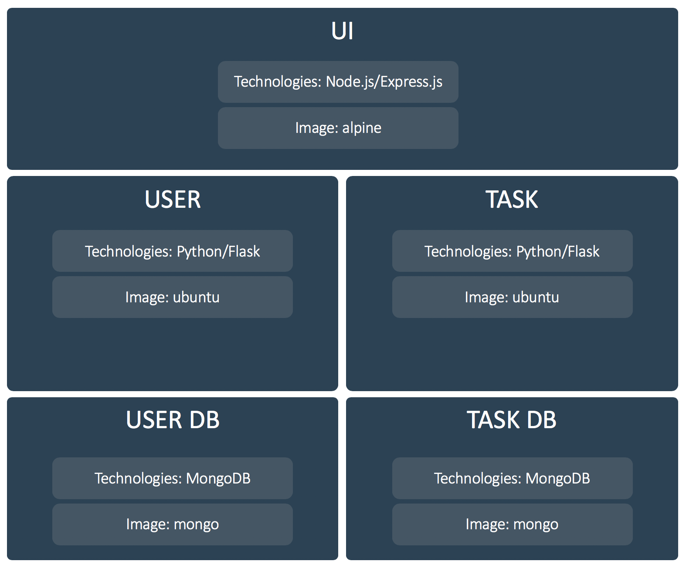
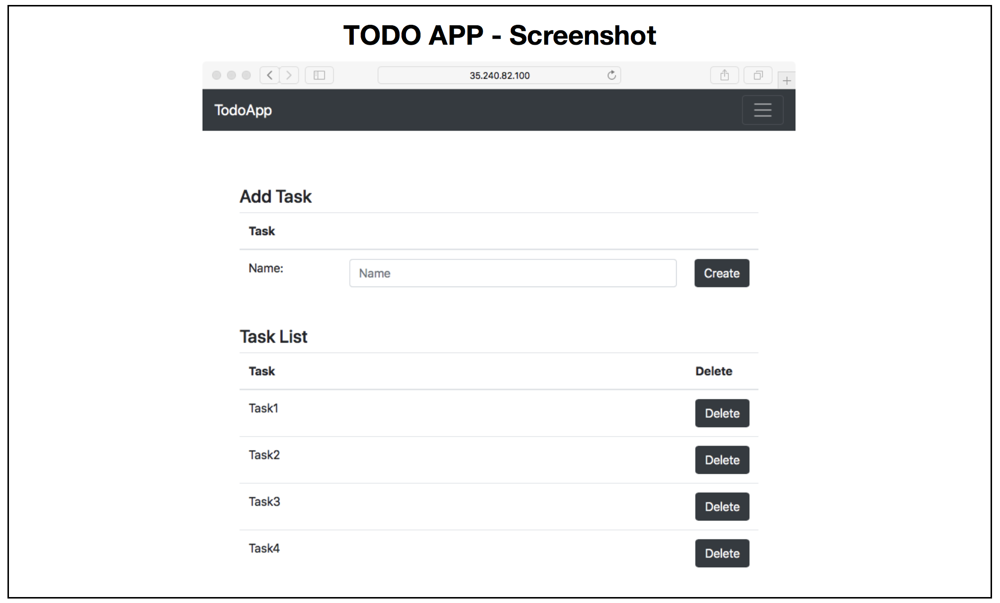

# microservice_todo

This is a Todo microservice application on Kubernetes.

<br>
<br>





<br>

Checkout repositories:

```
git clone https://github.com/dynatrace-innovationlab/developing-microservices.git
```

<br>

# Usage

### Deploy

Deploys the application to the Kubernetes cluster.

Execute in terminal:

```
sh deploy.sh
```

<br>

Check all ressources that have been created:

```
kubectl get deployments,pods,services -n todo
```

```
NAME                      DESIRED   CURRENT   UP-TO-DATE   AVAILABLE   AGE
deploy/todo-task-db-dep   1         1         1            1           3m
deploy/todo-task-dep      1         1         1            1           3m
deploy/todo-ui-dep        1         1         1            1           3m
deploy/todo-user-db-dep   1         1         1            1           3m
deploy/todo-user-dep      1         1         1            1           3m

NAME                                   READY     STATUS    RESTARTS   AGE
po/todo-task-db-dep-587d964cb-cpjd6    1/1       Running   0          3m
po/todo-task-dep-5849cbff9f-hq94m      1/1       Running   0          3m
po/todo-ui-dep-6df6c797bd-2c2rc        1/1       Running   0          3m
po/todo-user-db-dep-799dd794f8-f94jc   1/1       Running   0          3m
po/todo-user-dep-b86767b8f-fm7sx       1/1       Running   0          3m

NAME                   TYPE           CLUSTER-IP      EXTERNAL-IP     PORT(S)          AGE
svc/todo-task-db-svc   ClusterIP      10.63.243.124   <none>          27017/TCP        3m
svc/todo-task-svc      ClusterIP      10.63.245.42    <none>          8080/TCP         3m
svc/todo-ui-svc        LoadBalancer   10.63.249.213   35.233.69.142   8080:32257/TCP   3m
svc/todo-user-db-svc   ClusterIP      10.63.252.241   <none>          27017/TCP        3m
svc/todo-user-svc      ClusterIP      10.63.249.235   <none>          8080/TCP         3m
```

<br>

### Delete

To delete all resources, execute the following command.

Execute in terminal:

```
kubectl delete namespace todo
```
